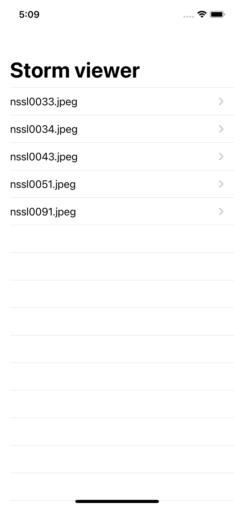
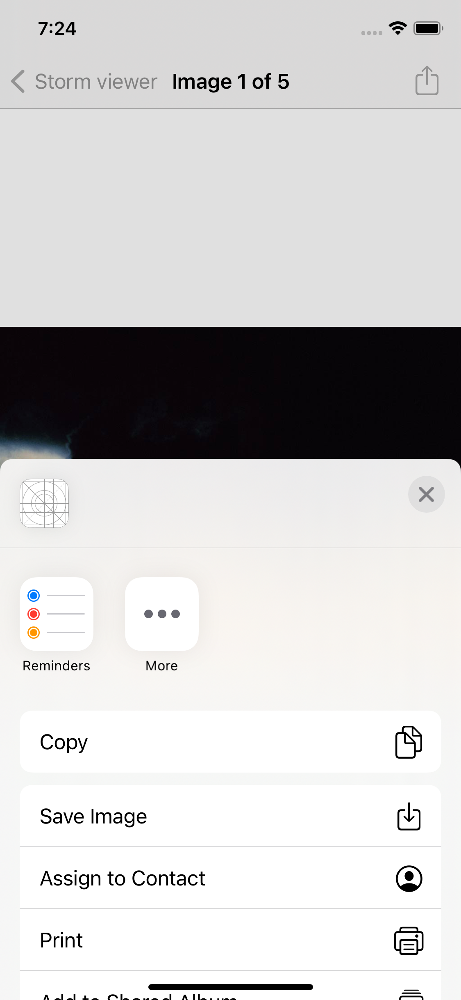

## Shtorm Viewer

## Tools to implement the project
- GCD
- FileManager
- Multiple ViewControllers.
- assert
- UIItabelViewController
- UIActivityViewController
- @objc, target, action
- #selector
- jpegData(CompressionQuality:)
- info.plist
 
 ## Project Screen Shots
  
 

## More features soon
- more pictures 
- pictures customization
  
##Supported devices
iPhone 6S and 6S Plus.
iPhone SE.
iPhone 7 and 7 Plus.
iPhone 8 and 8 Plus.
iPhone X.
iPhone XS, XS Max and XR.
iPhone 11, 11 Pro and 11 Pro Max.

## Conclusion 
It was first project which helped me to dive into UIKit and showed me how tabel view works. 
Even though it was a basic app, it was chalanging for me and takes three days to finish. 
I'm satisfied with work i've done and will return to make this up even more beautiful.

