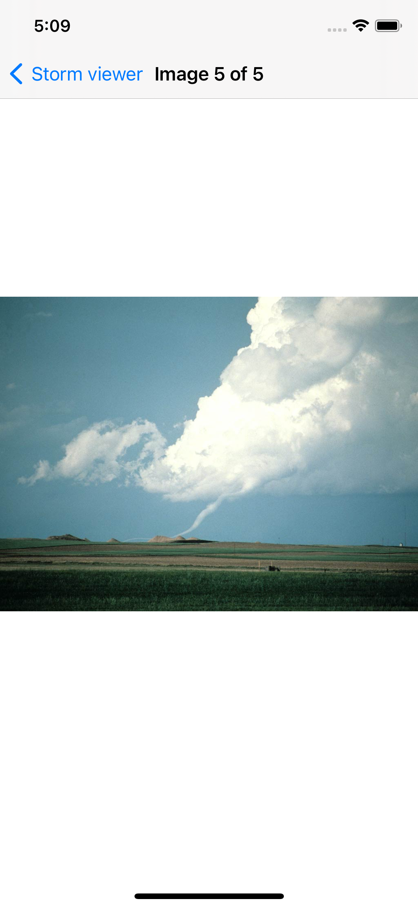

## Shtorm Viewer

## Tools to implement the project
- GCD
- FileManager
- Multiple ViewControllers.
 
 ## Project Screen Shots
 

## More features soon 
- animation
- more flags 
- settings 
  
## Conclusion 
It was interesting project which helped me to understand how works view in storyboard and code. 
Even though it was a basic app, it was chalanging for me and takes two days to finish. 
I'm satisfied with work i've done and will return to make this up even more beautiful.

